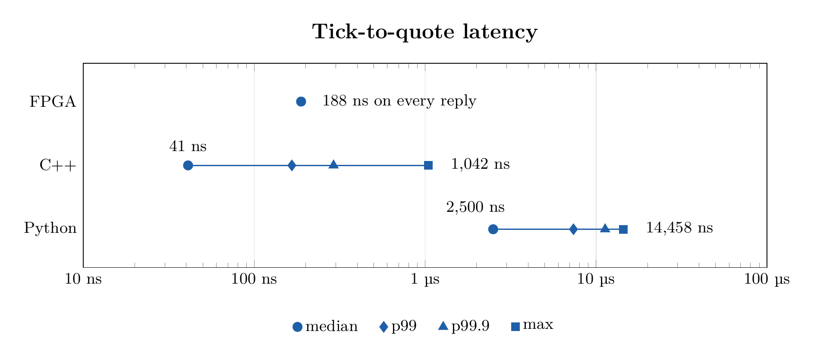

# FPGA Prediction Market Maker

A market maker for binary (yes/no) prediction markets, priced with Hanson's
LMSR and built three ways: as a circuit on an FPGA, in C++ and in Python. All
three produce identical quotes for the same order stream, so the only thing
left to compare is time.

**Devpost:** https://devpost.com/software/fpga-prediction-market-maker

Built at MHacks. The write-up for the submission is in [`DEVPOST.md`](DEVPOST.md),
and a longer explanation that assumes no trading or hardware background is in
[`docs/overview.pdf`](docs/overview.pdf).

## Results

Compute time per reply, from one benchmark run of 3,262 replies each at 400
requests per second:

| Version | Median | p99 | p99.9 | Max |
|---|---|---|---|---|
| FPGA (48 MHz) | 188 ns | 188 ns | 188 ns | 188 ns |
| C++ | 41 ns | 166 ns | 291 ns | 1,042 ns |
| Python | 2,500 ns | 7,375 ns | 11,291 ns | 14,458 ns |

- The FPGA takes 9 clock ticks on every reply. C++ is faster on a typical
  request, but its slowest reply is about 5.5 times slower than the FPGA's.
- All three versions agree byte for byte on 6,971 test requests and on four
  full simulated markets.
- The fixed-point price is within 0.004 cents of the exact LMSR formula.
- The design uses 2,011 of the chip's 7,680 logic cells, 12 of 32 block RAMs,
  and no multipliers.

## What's in the repo

| Path | Contents |
|---|---|
| `docs/spec.md` | Fixed-point spec, wire protocol and file formats |
| `docs/lmsr.pdf` | The LMSR math |
| `docs/overview.pdf` | Project explainer |
| `docs/fee_tuning.md` | Profit for every liquidity setting and extra spread |
| `golden/` | Python reference model, test vectors, multi-outcome prototype |
| `fpga/` | Verilog (APIO project) and testbenches |
| `mm_cpp/`, `mm_py/` | The software market makers |
| `gen/` | Seeded order-flow generator |
| `exchange/` | Exchange simulator: replays orders, tracks inventory and profit |
| `bench/`, `dashboard/` | Latency benchmark and its HTML report |
| `tools/` | Table generator, board replay, fee sweep, Polymarket feed |

## Hardware

The board is a "HailBoard" (Lattice iCE40 HX4K, UMich EECS 270), built with
the open-source APIO toolchain (yosys, nextpnr, icestorm). It talks to the
laptop over a 115200-baud serial link on `/dev/cu.usbmodem2103`.

## Running things

Build and check:

    make                      # build gen, exchange, mm_cpp
    make check                # same order streams into C++, Python and the FPGA; quotes must be identical
    fpga/run_tests.sh         # Verilog testbenches (Icarus Verilog)
    cd fpga && apio upload    # build and flash the market maker
    python3 tools/replay.py   # test requests against the board (--cmd mm_cpp/mm_cpp for software)

Benchmark:

    python3 bench/run.py --fpga-port /dev/cu.usbmodem2103   # leave off --fpga-port for software only
    open out/bench/index.html                               # latency table, chart and replay

Demos on the board:

    make demo                 # then press KEY0: replays a fixed 9999-order stream (RATE=200 orders/s)
    make live                 # quotes around a real Polymarket market (MARKET=slug to choose one)

Experiments:

    python3 tools/fee_sweep.py     # fee tuning -> docs/fee_tuning.md
    python3 golden/test_multi.py   # multi-outcome LMSR prototype (software only) vs floating point

`make check` runs C++ and Python only with `PORT=none make check`.

## Board controls

The displays are decimal: bid, ask (`--` when a quote is pulled), then the
number of fills.

| Control | What it does |
|---|---|
| KEY0 | Restart the market maker and replay the feed from the start |
| KEY1 | Kill switch on/off: pulls both quotes out of the market |
| KEY3 | Pause the feed at the current order |
| KEY2 | Resume the feed |
| SW17 | Up: the switches below override the laptop's settings |
| SW1:0 | Liquidity `b` = 64 / 128 / 256 |
| SW5:2 | Quote-size exponent (clamped so the size never exceeds `b`) |
| SW9:6 | Extra half-spread in cents |

The order feed lives on the laptop, so `make demo` must be running for KEY0,
KEY2 and KEY3 to do anything visible. Moving a switch updates the quote
immediately. LEDR0 shows the kill switch, LEDG1 shows paused, and LEDY shows
switches-enabled, kill, core-busy and UART activity. Keep SW17 down and leave
the buttons alone during `make check` and the benchmark.

## Live Polymarket mode

Install the one dependency first:

    python3 -m pip install -r requirements-polymarket.txt

`make live` follows the busiest active binary market priced between 15 and 85
cents (or the one named with `MARKET=slug`), reads its public order book, and
sends the mid price to the market maker on every update. The market maker
shifts its quotes to sit around that price. It is read-only: no orders are
placed and no wallet or key is needed.

- `make live MM=cmd:mm_cpp/mm_cpp` drives the C++ market maker instead of the board.
- Fills are simulated and rare, because the quote re-centres on every update,
  so the fill count usually stays at zero.
- KEY1 (kill) and KEY0 (restart) work in live mode. KEY3 and KEY2 do nothing,
  since a live feed cannot be paused.
- `python3 tools/polymarket_paper.py --seconds 60` runs the feed on its own as
  a paper trader, starting with $100,000,000 of paper cash (`--cash` changes this).
